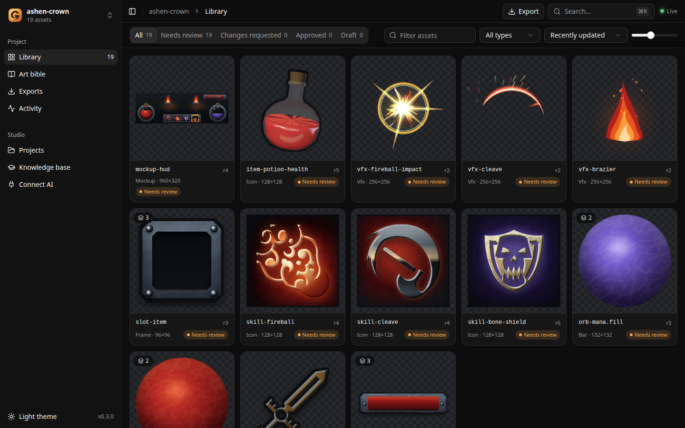
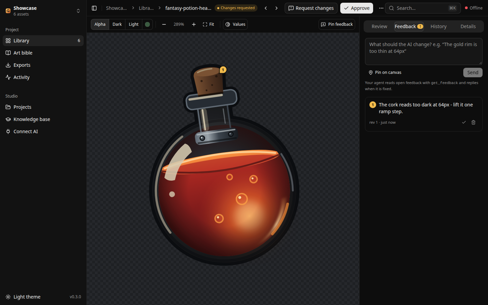
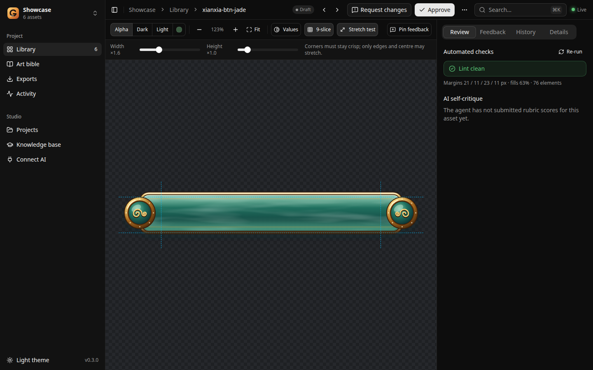
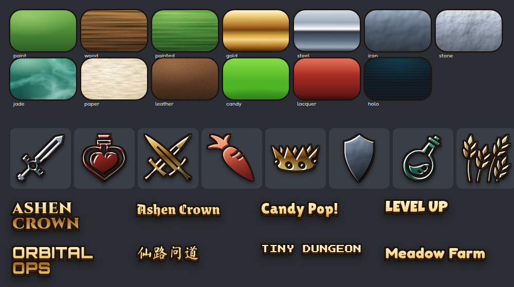
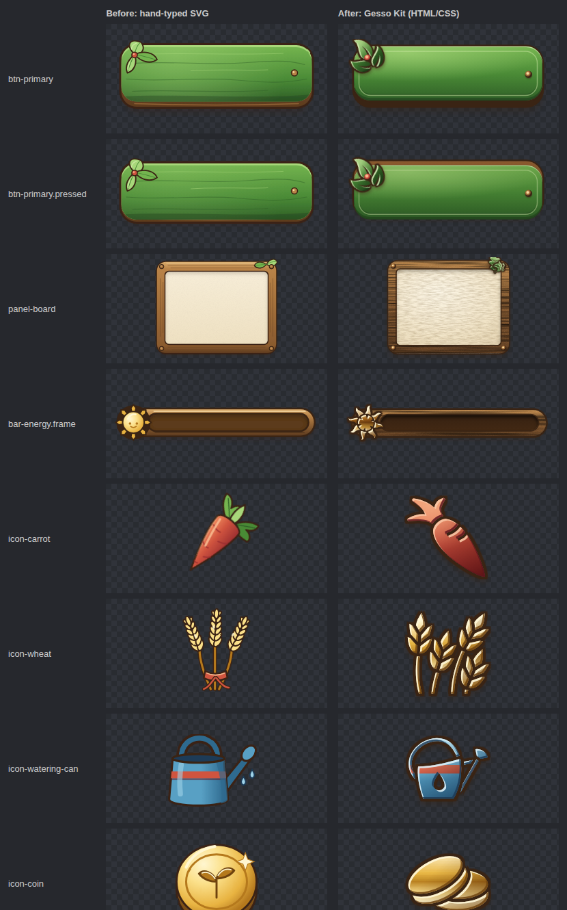
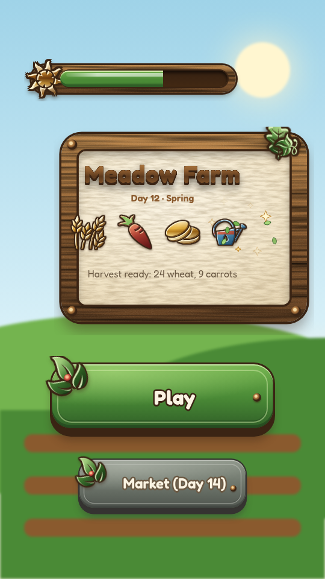
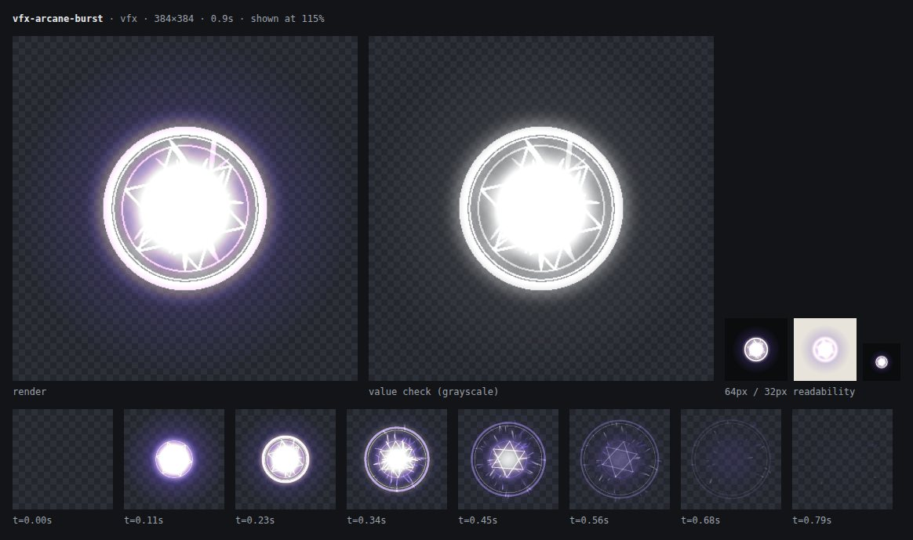

<div align="center">


# Gesso

**The open-source game art studio where your AI is the artist.**

Your coding agent draws the game art through MCP, following a real game-art knowledge base.<br/>
You review, comment, approve and export in a live local studio.

[Quick start](#quick-start) · [How it works](#how-it-works) · [MCP tools](docs/mcp.md) · [Architecture](docs/architecture.md) · [Contributing](CONTRIBUTING.md)

   



</div>

## Why Gesso

*Gesso* is the primer painters brush onto a canvas so the paint sits right. Gesso does the same for AI-made game art. Without it, an agent draws "programmer art": one gradient per shape, glow on everything, clip-art stars. With it, the agent works like a game artist does:

- **It builds on the whole web platform instead of hand-typing shapes.** The Gesso Kit gives the agent tuned CSS materials (wood, gold, hammered iron, jade, parchment, candy, hologram…), self-hosted game fonts, 4000+ professional silhouettes from game-icons.net, and PixiJS and three.js for VFX and rendered 3D. Fast, free and local, with no image-generation API.
- **It follows a craft, not a template.** The knowledge base covers the production workflow, light and value, hue-shifted color ramps, shape language, material recipes (gold, jade, glass, iron, energy…), SVG technique, a spec for each asset type, and genre style packs. Nothing in the code is tied to a genre; each project has its own **art bible**.
- **It sees its own work.** Every save is rendered in headless Chromium and returned to the agent as a review sheet: the render, a grayscale value check, 64 px and 32 px readability previews, and animation frames. Lint catches palette drift, clipping, broken 9-slice insets, silently ignored animation timing and unsafe SVG. The agent scores itself against a rubric and iterates.
- **You stay the art director.** The studio shows work as it happens. Approve it, request changes, or pin a comment on the exact pixel. The agent reads your feedback, fixes it and replies. Every revision is kept, so you can compare revisions with a swipe slider and restore any of them.
- **The output is game-ready.** Transparent PNG at @1x to @4x, sprite sheets with TexturePacker-style JSON (Pixi and Phaser read them directly), and a manifest with sizes, 9-slice insets and frame timing.

<table>
  <tr>
    <td width="50%"><br/><sub><b>Review:</b> pin feedback on the canvas; your agent picks it up via <code>get_feedback</code>.</sub></td>
    <td width="50%"><br/><sub><b>Stretch test:</b> see a 9-slice button stretched the way your engine will stretch it.</sub></td>
  </tr>
</table>

## The Gesso Kit



Assets are small HTML documents (or plain SVG) rendered by Chromium. The kit turns a silhouette plus a material into a shaded, outlined, rim-lit icon, gives UI parts real textures and bevels, and lets VFX use Pixi particles, bloom and shockwaves while Gesso drives time for deterministic sprite-sheet export. See the [`kit` guide](knowledge/kit.md).

<table>
  <tr>
    <td width="50%"><br/><sub><b>Before and after:</b> the same Meadow Farm assets, hand-typed SVG (left) and rebuilt on the kit (right).</sub></td>
    <td width="50%"><br/><sub><b>In context:</b> a main-menu mockup composed from the real assets, with kit fonts.</sub></td>
  </tr>
  <tr>
    <td colspan="2"><br/><sub><b>Pixi VFX</b> with bloom and streak particles: the review sheet shows the frames Gesso will export.</sub></td>
  </tr>
</table>

## Quick start

Requirements: **Node.js 22.19+** (or 24.11+) and **Google Chrome, Microsoft Edge or Chromium**. No Chromium browser? Run `npx playwright install chromium`, or set `CHROME_PATH`.

```bash
git clone https://github.com/gesso-studio/gesso.git
cd gesso
npm install
npm run build
npm start            # studio at http://127.0.0.1:4477
```

Open the studio and click **Open the showcase** to see sample assets, or add your game's art folder.

### Connect your agent

The **Connect AI** page in the studio shows ready-to-copy commands for the project you have open. They look like this:

**Claude Code**
```bash
claude mcp add --transport http gesso "http://127.0.0.1:4477/mcp?project=/path/to/my-game/art"
```

**Codex** (`~/.codex/config.toml`)
```toml
[mcp_servers.gesso]
url = "http://127.0.0.1:4477/mcp?project=/path/to/my-game/art"
```

**Cursor, VS Code, Windsurf** (`mcp.json`)
```json
{ "mcpServers": { "gesso": { "url": "http://127.0.0.1:4477/mcp?project=/path/to/my-game/art" } } }
```

**Claude Desktop and other stdio-only clients** use the bridge. It starts the studio in the background if it isn't running:
```json
{ "mcpServers": { "gesso": { "command": "node", "args": ["/path/to/gesso/bin/gesso.mjs", "mcp", "--project", "/path/to/my-game/art"] } } }
```

Then ask your agent something like:

> Read the Gesso project, propose an art bible for my cozy farming game, and wait for my OK. Then make the main-menu buttons with pressed and disabled states.

## How it works

```text
 you ──prompt──▶ agent ──MCP──▶ Gesso server ──▶ my-game/art/
  ▲                ▲                │   │          ├── STYLE.md        art bible
  │                └─review sheet───┘   │          ├── assets/*.svg    source art (git-friendly)
  │                                     │          └── exports/        PNG, sprite sheets, manifest
  └──── studio: review · feedback ◀─────┘
        history · export                ~/.gesso/gesso.db  (SQLite: projects, revisions, feedback, activity)
```

1. **Art bible first.** With no `STYLE.md`, the agent reads the workflow guide and the closest style pack, agrees on a direction with you, and writes the art bible. Its hex codes become the palette that lint enforces.
2. **Draw, look, critique, repeat.** For each asset the agent reads the asset-type guide, builds it on the Gesso Kit (HTML/CSS, silhouettes, Pixi or three.js) or as SVG, and calls `save_asset`. It critiques the review sheet it gets back, submits rubric scores, and revises until every score passes.
3. **Review in the studio.** New revisions appear live. You approve them or leave feedback, which the agent reads and resolves.
4. **Export** engine-ready files when the set is approved.

Your art stays as plain SVG files in your project folder, so it can live in the game's repository. Revisions, feedback and activity are kept in a local SQLite database, one per machine. Nothing leaves your computer.

## Knowledge base

| Area | Guides |
| --- | --- |
| Process | `workflow`, `kit`, `critique` (rubric + anti-slop list), `art-bible` (template) |
| Fundamentals | `light-value`, `color`, `shape`, `materials`, `svg-craft` |
| Asset types | `button`, `panel`, `icon`, `bar`, `vfx`, `mockup` |
| Style packs | `xianxia`, `dark-fantasy`, `heroic-fantasy`, `sci-fi`, `casual`, `pixel` |

Guides live in [`knowledge/`](knowledge/) and can be browsed in the studio. They are the highest-leverage place to contribute: a better material recipe improves every future asset. See [Writing knowledge](docs/knowledge-authoring.md).

## Studio features

- **Library:** filter by review status, type and text; states grouped under their master asset; adjustable thumbnails; ⌘K command palette.
- **Viewer:** alpha, dark, light or custom backdrop; zoom around the cursor; pan; grayscale value check; 9-slice guides and stretch test; animation playback, scrubbing and frame stepping.
- **Review:** lint results, the agent's self-critique scores, approve and request-changes actions, pinned feedback threads with agent replies.
- **History:** every revision (from the agent, from disk edits and from restores), a swipe comparison, and one-click restore.
- **Art bible:** rendered view with the enforced palette, plus an in-place editor.
- **Exports**, a live **activity** feed, **multi-project** support, dark and light themes.

## Configuration

| Variable | Default | Purpose |
| --- | --- | --- |
| `GESSO_PORT` | `4477` | Studio and MCP port. |
| `GESSO_HOST` | `127.0.0.1` | Bind address. Gesso rejects non-local Host and Origin headers either way. |
| `GESSO_HOME` | `~/.gesso` | SQLite database, logs and the sample project. |
| `GESSO_PROJECT` | none | Default project for `gesso mcp` (same as `--project`). |
| `GESSO_ALLOWED_HOSTS` | none | Extra `host:port` values to accept, e.g. behind a trusted reverse proxy. |
| `CHROME_PATH` | auto | Chromium-based browser used for rendering. |

## Development

```bash
npm run dev        # studio with hot reload on http://localhost:3000
npm run typecheck  # vue-tsc over app and server
npm run build      # production build in .output/
npm test           # end-to-end test against the build (MCP over HTTP and stdio, security, feedback, export)
```

The stack is Nuxt 4 (Vue 3, Nitro), Tailwind CSS 4, shadcn-vue, SQLite through `node:sqlite`, and Playwright Core driving a local Chromium. See [docs/architecture.md](docs/architecture.md).

## Roadmap

- A brilliant-cut gem generator, coin and bottle presets for three.js items, and more Pixi VFX recipes in the kit.
- Calibrated critique: anchor examples for each score so self-review cannot drift upward.
- More style packs and asset types: characters, tilesets, cards, map markers.
- Engine exporters for Godot, Unity and Defold import settings.
- An npm release, so `npx gesso-studio` works without cloning.

## License

Gesso is licensed under the [Apache License 2.0](LICENSE). Assets you and your agent create are yours.

The kit redistributes third-party fonts (SIL OFL 1.1, Apache-2.0), icons (game-icons.net under CC BY 3.0, Lucide under ISC) and libraries (PixiJS, three.js, Rough.js under MIT); see [NOTICE](NOTICE). Games that ship game-icons silhouettes must credit game-icons.net; `export_assets` writes the credits into the manifest.
